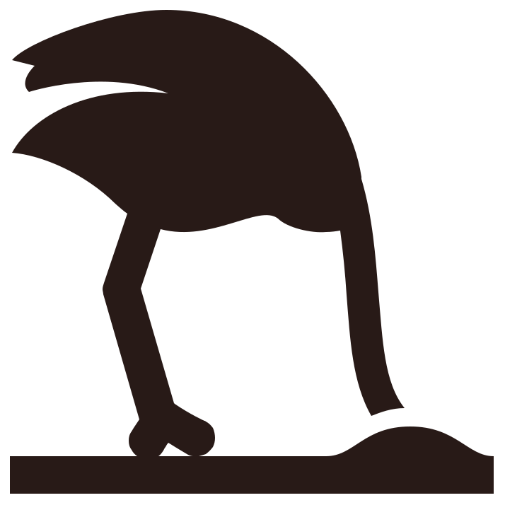

class: title-slide, inverse, left, middle

background-image: url(fig/kisscc0-gaggle-of-geese.png)
background-position: right bottom
background-size: 600px

```{css, echo = FALSE}
.title-slide .remark-slide-number {
  display: none;
}

.large { 
  font-size: 130%;
  }
.small { 
  font-size: 70%;
  }
.tiny { 
  font-size: 40%;
  }

```

```{r setup, include=FALSE}
library(tidyverse)
options(htmltools.dir.version = FALSE)

cp <- function(keys, ..., bib=ip_bib){
  keys <- gsub("^@", "", keys)
  RefManageR::Citep(bib, keys, ...)
}
ct <- function(keys, ..., bib=ip_bib){
  keys <- gsub("^@", "", keys)
  RefManageR::Citet(bib, keys, ...)
}

RefManageR::BibOptions(check.entries = FALSE, bib.style = "authoryear", style = "markdown",
           dashed = TRUE)
ip_bib <- rbbt::bbt_write_bib('intro-paper-am.bib', overwrite = TRUE) %>% 
  RefManageR::ReadBib()
```

```{r xaringan-extra-all-the-things, echo=FALSE}
xaringanExtra::use_xaringan_extra(
  c("tile_view", "panelset", "tachyons")
)

#xaringanExtra::use_share_again()
#xaringanExtra::style_share_again( share_buttons = "all")

xaringanExtra::use_tachyons()

xaringanExtra::use_extra_styles(
  hover_code_line = TRUE,         #<<
  mute_unhighlighted_code = TRUE  #<<
)

xaringanExtra::use_logo("fig/lu-logo.png",
                        link_url = "https://www.cec.lu.se/")
```

```{r xaringan-themer, include=FALSE, warning=FALSE}
library(xaringanthemer)
style_duo(
  primary_color = "#f7f7f7", secondary_color="#281a17",
  header_font_google = google_font("Josefin Sans"),
  text_font_google   = google_font("Montserrat", "300", "300i"),
  code_font_google   = google_font("Fira Mono")
)
```

#Environmental models in waterfowl management under uncertainty

###Introductory paper seminar
<br><br><br><br><br><br><br>
**Dmytro Perepolkin**<br>

PhD Student, UnEviL Group<br>
Centre for Environmental and Climate Research<br>
Lund University | `r format(Sys.Date(), "%d %B %Y")`

---
class: inverse, center, middle

# Environmental decisions

---
# What makes environmental decisions difficult?
.pull-left[
### Like earth science

- Complexity, ambiguity

- Exploitation and conservation

### Unlike earth science

- Dynamism, interconnectedness of systems

- Ethics/values questions

- Multiple actors (animals, agencies, authorities, hunters, citizens)
]

.pull-right[

```{r, out.width=400, echo=FALSE}

```

```{r, out.width=350, echo=FALSE}

```

]

---
# Waterfowl resources
.pull-left[
```{r, out.height="40%", fig.retina=2, echo=FALSE}

```
<br><br>
.small[*Image: [Waterfowl management blog](https://npc9.wordpress.com/2013/04/)*]
]

.pull-left[
### Anseriformes, Family Anatidae
- 146 species in 43 genera. Prized quarry for hunters `r cp("@kear2005DucksGeeseSwans")`

- Mostly unregulated hunting up until early XX century. Loss of habitat and overdepletion as a result

- Hunting regulation and creation of wildlife refuges turned the trend around for most species

- Today waterfowl management is arguably a hallmark of success in environmental resource management `r cp("@nichols1995ManagingNorthAmerican")`
]

---
class: inverse, center, middle

# Risk and uncertainty

---
# Glossary

`r ct("@knight1921RiskUncertaintyProfit")` proposed the following definitions of "risk" and "uncertainty":
.pull-left[
#### Risk
- Outcome is not known, but the frequency distribution from which an outcome of interest is drawn ("source distribution") is well understood. It is possible to know how likely each outcome is to appear `r cp("@morgan1990UncertaintyGuideDealing")`
- It is, therefore, appropriate for the "plausibility reasoning robot" `r cp("@jaynes2003ProbabilityTheoryLogic")` to characterize the uncertainty in a randomly picked (sampled) outcome by a probability distribution with the same parameters as the known frequency distribution.
- Such uncertainty is called "aleatory", from Latin - *alea* - dice `r cp("@fox2011DistinguishingTwoDimensions")`
- Can not be reduced, only "resolved".
]

--

.pull-right[
####Uncertainty
- "Source distribution" is unknown
- The lack-of-knowledge about such source frequency distribution is called "epistemic" uncertainty from Greek - *episteme* - knowledge.
- Expressed with probability, indicating "degree of belief" `r cp("@ohagan2004DicingUnknown")` or "plausibility" `r cp("@jaynes2003ProbabilityTheoryLogic")`. The probability is personal, but not arbitrary, because it is consistent with probability axioms and "plausibility reasoning desiderata" `r cp(c("@morgan1990UncertaintyGuideDealing", "@jaynes2003ProbabilityTheoryLogic"))`
- Can be, in principle, reduced through exploration, experimentation and knowledge acquisition `r cp("@kleindorfer2010ReflectionsDecisionMaking")`
]

---
# Epistemic uncertainty

- Bayesian Analysis
    - reason about the “source distribution” based on samples. 
    - infer parameters, while the "likelihood" is fixed, but the two are inseparable `r cp("@gelman2017PriorCanGenerally")`
    - model uncertainty can, sometimes, be converted into parameter uncertainty `r cp("@morgan1990UncertaintyGuideDealing")`

--

- Model uncertainty
    - Not only about the choice of probability distribution, but also about the functional form or alternative theory, aka "structural uncertainty" `r cp("@bojke2009CharacterizingStructuralUncertainty")`
    - Can not assign probabilities, only weights reflecting relative plausibility `r cp("@cox2012ConfrontingDeepUncertainties")`

--

- Ontological uncertainty
   - Future changes in 
       - beliefs(models), 
       - values(objectives) and 
       - available choices (alternatives) `r cp("@derbyshire2019AnswersQuestionsUncertainty")`
   - Requires non-probabilistic scenario-based methods 

---
class: inverse, center, middle

# Decision Analysis

---
# Epistemology in science
.pull-left[ 
###Rationalism

- Can be traced back to XVII century philosophers, including Spinoza, Leibniz and Kant.

- Descartes: deductive reconstruction of knowledge starting from *cogito, ergo sum*

- Senses are untrustworthy, logical reasoning can provide unquestionable truth about the world. 

- Tearing down the world to reconstruct it

- Ultimate question: "Is it so?"
]

--
.pull-right[
###Pragmatism

- Originated in late XIX century in the East Coast USA (Harvard, Johns Hopkins University)

- Pierce and Dewey: Uncertainty is deliberation on "what to do", conditioned and directed by the goals and alternatives considered. These determine what is perceived as "relevant".

- Otto Neurath: "Search for truth ~ repairing a ship in high seas". Limited realism.

- Ultimate question: "Will it work"?

]

.footnotes[
<br><br>
[1] `r ct(c("@kim2017PragmaticEncroachmentEpistemology","@norton2002PragmatistEpistemologyAdaptive"))`
]
---
# Decision analysis

A discipline at the crossroads of statistics, normative decision science, behavioral psychology and organization theory. First proposed by Ronald A. Howard, supported by Howard Raiffa.  Most often associated with Operations Research.
.pull-left[
#### Main components
- Subjectivist interpretation of probability (Bernoulli, Laplace)

- Decision-theoretic view of probability and utility (Keynes, Ramsey, de Finetti, Savage)

- Acknowledging and accounting for decision biases (Kahneman & Tversky)

- Prescriptive ("engineering") approach to decision structuring (Howard, Raiffa)
]
--
.pull-right[
#### Formal Decision Process

- Formal approach to the "process of deciding"

- **DQ**: West-coast school `r cp(c("@howard1977ReadingsDecisionAnalysis","@matheson2005DecisionAnalysisDecision"))`

- **PrOACT**: East-coast school `r cp(c("@keeney1976DecisionsMultipleObjectives","@keeney1999SmartChoicesGuide"))`. 

- In environmental management known as Structured Decision Making `r cp("@gregory2012StructuredDecisionMaking")`
]

--

#### “Modeling” approach to DA
- Decision model as a product. “Extra-personal representation” of the problem.
- The objective is not "the right answer", but the "clarity of action".

---
# Values in DA.

.pull-left[
- Weber, Kuhn: Value-free ideal = "epistemic values only" `r cp("@douglas2015ValuesScience")`

- Non-epistemic values allowed only in "external aspects" 

```{r dot-values-diagram, engine = "dot", fig.cap = "Values diagram", cache=TRUE, echo=FALSE}
digraph test123 {
  graph [bgcolor=transparent]
  v [label="Non-epistemic\nvalues"];
  d[label="Direction\nin research"];
  e[label="Sufficiency\nof evidence"];
  m[label="Choice of\nmethod"]
  e_fp[label="More Evidence", shape=none];
  e_fn[label="Less Evidence", shape=none];
  v -> d; v->e;v->m;
  e->e_fp[headlabel="false\npositive", labelangle=90, labeldistance=3, fontname="times italic"]; 
  e->e_fn[headlabel="false\nnegative", labelangle=270, labeldistance=3, fontname="times italic"];
}
```
]
--
.pull-right[
- Pragmatists: values are inseparable from scientific inquiry and need to be embraced and examined
`r cp("@stuhr2003PragmatismValuesValuable")`

- Multi-Criteria Decision Analysis (MCDA): systematically eliciting inputs from various stakeholders, using models to combine them with the aim of ranking alternatives.

- Criticism of decision analysis: assumes decision maker is aware of her own values (see non-bayesian decision theory `r cp("@peterson2008NonbayesianDecisionTheory")`). But the aim is not to provide "the right answer", but to usher the "clarity of action".

- Difficulty to trade-off is not the same as difficulty to enumerate values.

]

--

#### Question: Can Decision Analysis "objectify" discussion about values the way Bayesian Analysis "objectified" subjective probabilities?
---
class: inverse, center, middle

# Models

---
# Modeling of the system
.pull-left[
Environmental systems are rich in multiple types of uncertainty `r cp("@williams1996UncertaintyAdaptiveManagement")`:
- **natural variation**: stochastisity 

- **limited observability**: monitoring

- **limited controllability**: implementation

- **structural uncertainty**: incomplete understanding

Level of detail in the model:

- "reductionist" approach of modeling transferable universal phenomena `r cp("@schuwirth2019HowMakeEcological")` to minimize number of parameters

- pragmatic decision-focused approach `r cp("@howard2007FoundationsDecisionAnalysis")`. Only details material to decision should be included.
]

.pull-right[

Traditional (black) and emerging (blue) approaches to modeling

```{r modelsplot, echo=FALSE, message =FALSE, error=FALSE, warning=FALSE,fig.width=6, fig.asp=0.8}

tbl <- dplyr::tribble( ~x,  ~y,    ~clr, ~lbl,
               0.1, 0.1, "grey50","No model \nsolution",
               0.2, 0.8, "black", "Mechanistic models, \ne.g. ODE, IBM/ABM",
               0.4, 0.6, "black", "State-space models, \ne.g. HBM, HMM, SEM",
               0.6, 0.4, "black", "Statistical models, \ne.g. GLM, GAM",
               0.8, 0.2, "black", "Machine learning, \ne.g. ANN",
               0.9, 0.9, "royalblue2", "Theory based \ndata science")

ggplot(tbl)+
  geom_text(aes(x,y, label=lbl, color=I(clr)), size=5)+
  scale_x_continuous(limits = c(0,1))+
  scale_y_continuous(limits = c(0,1))+
  theme_classic()+
  theme(axis.text = element_blank(),
        axis.ticks = element_blank(),
        axis.title=element_text(size=8))+
  labs(x="Data availability",
       y="Knowledge about the system")

```

Figure adopted and modified from `r ct("@schuwirth2019HowMakeEcological")`
]
---
# Modeling of decision making

Most decisions in environmental management are recurring. Markov Decision Process (MDP) is mathematical model for sequential decision making in stochastic environments `r cp("@puterman1994MarkovDecisionProcesses")`.

#### Basic idea:

- agent is placed within stochastic environment, which changes in response to his actions
    
- the state of the environment affect agent's rewards and the future states the environment can transition into

#### Objective:

- select a sequence of actions that will maximize long-term reward

- embedded trade-off: receive utility now or improve chances of obtaining utility in the future 

#### Variations:

- with regards to uncertainty: known parameters vs. MDP under uncertainty

- based on process observability: fully observable vs. partially observable MDP (POMDP)

---
class: inverse, center, middle

# Adaptive Management

---
# Do &rarr; Learn &rarr; Do 

.left-column[
###Active AM
]
.right-column[
- Most important is learning `r cp("@rist2013AdaptiveManagementWhere")`

- Explicit accounting for uncertainty 

- Main purpose of interventions is to reduce uncertainty `r cp("@williams2011PassiveActiveAdaptive")`

- AM program is a good as experimental design underlying it `r cp("@gregory2006DeconstructingAdaptiveManagement")`

- Employs multiple experimental models, targeting individual unknowns and a single management model

- Able to learn fast

- `r emo::ji("moneybag")``r emo::ji("moneybag")``r emo::ji("moneybag")`
]

---
# Do &rarr; Learn &rarr; Do 

.left-column[
###Active AM
###Passive AM
]
.right-column[
- Learning is only a byproduct of the objective-based management: anticipated, but interventions are not specifically targeting it

- Using one "most appropriate" model `r cp("@martin2009StructuredDecisionMaking")` or model averaging `r cp(c("@nichols1995ManagingNorthAmerican", "@williams2002AnalysisManagementAnimal"))`.

- Model weights are arrived at using judgment from previous iterations (better fit to future data).

- Learning is slower; Crucial to have diverse models targeting varied hypotheses

- Frugal on budget
]

---
# Do &rarr; Learn &rarr; Do 

.left-column[
###Active AM
###Passive AM
###Steady state
]
.right-column[
- "Passive-aggressive"?

- Do nothing, wait-and-see, maintain status-quo  


<br><br>

`r ct("@rist2013AdaptiveManagementWhere")` literature review:

- AM is misunderstood and misinterpreted

- Often AM is confused for "trial and error" approach.

- Far from original meaning in `r ct("@holling1978AdaptiveEnvironmentalAssessment")`: "proactive experimentation as a method of learning".

]
 
---
# AM schools of thought

Literature on adaptive management tends to be concentrated around two main camps `r cp("@mcfadden2011EvaluatingEfficacyAdaptive")`
.pull-left[
```{r amplot, echo=FALSE, message =FALSE, error=FALSE, warning=FALSE, fig.asp=0.7}
library(ggplot2)
library(ggforce)

df.venn <- data.frame(x = c(-0.866, +0.866),
                      y = c(-0.5, -0.5),
                      labels = c('Resilience-Experimentalist\n(RE) School', 'Decision-Theoretic\n(DT) Schoool'),
                      txt=c("Stakeholders:\n process,\nhypotheses\n\nResilience\n\nExperimentation:\ngains knowledge\n\nComplex ecological models",
                            "Stakeholders:\n objectives,\nalternatives\n\nDecision Analysis (SDM)\n\nExperimentation:\nnot necessary\n\nSimpler ecological models"
                            ),
                      hjust=c(0,1))

ggplot(df.venn) +
  geom_circle(aes(x0 = x, y0 = y, r = 1.5, fill = labels, colour = labels),
              alpha = .3, size = 1, show.legend = FALSE) +
  geom_text(aes(x=c(-1,1), y+1, label=labels, hjust=c(0.5,0.5)), fontface="bold", cex=5)+
  geom_text(aes(x=c(-2,2), y-0.1, label=txt, hjust=hjust), cex=4)+
  annotate("text",x=0, y=0-0.4, label="Iterative\nProcess\n\nMonitoring\n\nCollaboration\n\nUncertainty",
           fontface="italic", cex=4)+
  coord_fixed() +
  theme_void()+
  scale_fill_brewer(palette =  "Dark2")+
  scale_color_brewer(palette = "Dark2")
```
]
.pull-right[
#### RE school
- originates from work of `r ct("@gunderson2010BarriersBridgesRenewal")`
- Complex environmental models aiming to capture every detail

#### DT school
- focuses on defining the problem, clarifying objectives and developing management alternatives prior to building process models `r cp("@johnson1999ProtocolPracticeAdaptive")`. 
- less complex models, focused on decision problem at hand
- adopted by US Dept of Interior for North American Waterfowl Management Plan `r cp("@nichols1995ManagingNorthAmerican")`
]

---
# Adaptive Management and VOI

- Value of Information (VOI) is "potential management value that is foregone under uncertainty" `r cp("@williams2011AdaptiveResourceManagement")`. Without the information *a different management action* is
preferred. If the the wrong action is taken, the expected performance will be lower and therefore, decision maker will suffer an “opportunity loss” `r cp("@raiffa1970DecisionAnalysisIntroductory")`. 

- In its simplest form VOI is a difference between value with and without the information. Difference in value originates from changed course of action.

- Can guide allocation of resources towards areas with the highest impact on the choice of management actions `r cp("@runge2011WhichUncertaintyUsing")`

- Gradual adaptation balances *learning* and *management* `r cp("@moore2017TwostepAdaptiveManagement")` ("dual-control problem")

- Results of the VOI analysis are conditional upon the context of the decision
(decision frame), choice of the value metric (objectives), and the set of management actions it considers. Other factors affecting the result are choice (and structure) of model and specific parametrization 

Classic DA books discuss VOPI (Value of Perfect Information), which forms "upper limit" for VOI. In practice information is always imperfect, so Expected Value of Partial Information `r cp("@williams2015ValueInformationNatural")` and Expected Value of Sample Information `r cp("@runge2011WhichUncertaintyUsing")` is used.

---
class: inverse, center, middle

# Waterfowl Management
---
# Management Objectives and Responses

There are many objectives and alternatives mentioned in the waterfowl management literature. Systematic research of both is, however, lacking. `r cp(c("@fox2017AgricultureHerbivorousWaterfowl", "@stroud2017KeyActionsSustainable", "@bradbeer2017CrowdedSkiesConflicts", "@fox2019UrbanGeeseLooking"))`. 
.pull-left[
#### Management objectives
- Stable and sustainable population size(+)
- Threat to public health and safety(-)
- Cultural/recreational value for birdwatchers and tourists
- Conservation activism
- Tundra degradation in breeding range(-)
- Conflict with agriculture(-)
- Hunter recreation opportunities (+)
- Long-term aggregated harvest(+)
- Annual hunting season length(+)
- Frequency of changes in regulation(-)
- Risk to air traffic safety (-)
- International treaties compliance(+)
]

.pull-left[
#### Management alternatives
- Harvest
- Disturbances and deterrents
- Provision of sacrificial feeding areas
- Compensation to farmers
- Coordination of attractive fields for refuge
- Stakeholder engagement and co-management
]

---
# Waterfowl management worldwide

## USA
- North American Waterfowl Management Plan is a hallmark of success. 
- Population monitoring programs, flyway-scale wildlife research and management working groups 
- State-of-the-art population models and advising harvest regulation across the continent

--

## Europe
- African-Eurasian Waterbird Agreement (AEWA) drafted in 1999 is today ratified by 80 countries. Backed up by EU Bird Directive (2009/147/EC).
- European Goose Management Platform (2016) initiated species-focused working groups for developing ISMP (International Species Management Plans) for *pink-footed goose* and *taiga bean goose* (with *barnacle goose* and *greylag goose*) in the working.
- Experience transfer from North America with Fred A. Johnson (US. Geological Survey) advising the EGM IWG.
---
# Decisions in waterfowl management

```{r dot-wm-decisions-diagram, engine = "dot", cache=TRUE, echo=FALSE, fig.align='center'}
digraph test123 {
  graph [bgcolor=transparent, layout=fdp]
  h1[label="Harvest", xlabel=<<i>Hunting quotas</i>>, shape=circle];
  h2[label="Habitats",xlabel=<<i>Habitat conservation</i>>,  shape=circle];
  h3[label="Human\nDimensions",xlabel=<<i>Interaction with people</i>>, shape=circle];
  h1 -> h2 [dir=none];
  h2 -> h3 [dir=none];
  h3 -> h1 [dir=none];
  
}
```
---
# Harvest

.pull-left[
3 steps taken on annual basis `r cp("@johnson2000AdaptiveRegulationWaterfowl")`:

1. Identify optimal regulatory action, based on the knowledge about the state of the system (e.g. population characteristics) and the weights of the alternative models
2. Given the optimal regulatory action, determine model-specific projections of population size
3. When next year's monitoring data is available, adjust model weights according to individual model's ability to predict the change in population

[1] `r cp("@williams1996UncertaintyAdaptiveManagement")`
]

.pull-right[

```{r duckcycle, echo=FALSE, message =FALSE, error=FALSE, warning=FALSE}
library(DiagrammeR)
library(DiagrammeRsvg)

DiagrammeR::grViz("fig/duckcycle.gv", width = 400, height = 500)
```

]
---
# Habitats

Improvement of habitats is one of the key objectives of EU Bird Directive `r cp("@europeanparliament2010Directive2009147")`. Explicit (mechanistic) models can fit the data more accurately and provide prediction outside of training range `r cp(c("@nichols1995ManagingNorthAmerican", "@baveco2017CombiningModellingTools"))`. 

.pull-left[
#### ABM
- Traditionally addressed with Ordinary Differential Equations

- Lowered cost and accessibility of computation made agent-based models (ABMs) feasible

- ABMs are simulation tools for studying populations `r cp("@grimm2005IndividualbasedModelingEcology")`

- Explicit accounting for interaction between agents and their environments 

]
.pull-right[
#### Specialized ABMs for waterfowl management
- Pettifor et al. model: barnacle goose and the dark-bellied brent goose `r cp("@pettifor2000SpatiallyExplicitIndividualbased")`
- AlmaSS model. Animal, Landscape, and Man Simulation System (ALMaSS) used to support AEWA goose project `r cp("@williams2018WhereGoGoose")`
- SWAMP model. Waterfowl foraging on wintering grounds in North America `r cp("@miller2014SWAMPAgentbasedModel")`
- MORPH model. Predicting effect of environmental change on foraging populations `r cp("@stillman2008MORPHIndividualbasedModel")`

]
---
# Human dimensions

Waterfowl management policy should to be considered in the integrated social-ecological context,
incorporating stakeholder objectives and incentives `r cp(c("@madsen2015GuidelinesSustainableHarvest", "@johnson2015TrainingConservationPractitioners"))`.

- Perspectives of different stakeholder might vary (citizens vs hunters vs authorities vs farmers). Within human-nature conflict there's usually human-human conflict embedded.

- Difficulties of governing. Change of management objectives at the pressure of stakeholders. Case of mid-Norway geese management `r cp("@eythorsson2017GooseManagementSchemes")`

- Need for multi-agent, multi-objective (behavioral) coupled simulation `r cp("@liu2007ComplexityCoupledHuman")`

#### Question: Should scientists model stakeholder objectives explicitly given that they affect success of management actions implementation?

---
class: inverse, center, middle

# Conclusions
---
# Key takeaways

.pull-left[
- Environmental decisions require structured approach. 

- Decision Analysis offers prescriptive approach to improving decision making. Principles, process and methods embracing uncertainty, objectives and decision alternatives.

- MCDA-based Adaptive Management approach for iterative decision making is successfully adopted in waterfowl management in North America and in Europe.

- Model-based decision analysis utilizes various statistical and simulation models for modeling of systems, environments and agents aiming to provide clarity of action for decision makers.
]

.pull-right[

]

```{r, echo=FALSE}

printbib_paginated <- function(bib, i, n){
    len_bib <- length(bib)
    RefManageR::PrintBibliography(bib, start = min(len_bib,(i-1)*n+1), 
                                  end=min(len_bib, i*n))
  }

make_slides <- function(bib, bib_var, title, by){
  len_bib <- length(ip_bib)
  max_ref_slides <- ceiling(len_bib/by)
  
  pgs <- glue::glue(
             "---",
             "```{r references-{{i}}, results='asis', echo=FALSE}",
             "cat('<h1>{{title}}</h1>')",
             "printbib_paginated({{bib_var}},{{i}},{{by}})",
             "```", .sep = "\n", .open = "{{", .close = "}}", 
             i=1:max_ref_slides)
  glue::glue_collapse(pgs, sep="\n")
}
```

`r knitr::knit(text=make_slides(ip_bib, "ip_bib", "References", 5))`

