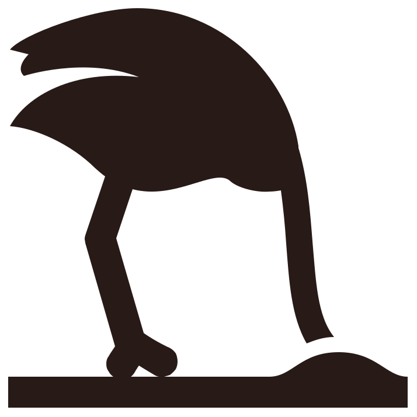

class: title-slide, inverse, left, middle

background-image: url(fig/kisscc0-gaggle-of-geese.png)
background-position: right bottom
background-size: 600px

```{css, echo = FALSE}
.title-slide .remark-slide-number {
  display: none;
}
```

```{r setup, include=FALSE}
options(htmltools.dir.version = FALSE)
library(RefManageR)
```

```{r xaringan-extra-all-the-things, echo=FALSE}
xaringanExtra::use_xaringan_extra(
  c("tile_view", "panelset", "tachyons")
)

#xaringanExtra::use_share_again()
#xaringanExtra::style_share_again( share_buttons = "all")

xaringanExtra::use_tachyons()

xaringanExtra::use_extra_styles(
  hover_code_line = TRUE,         #<<
  mute_unhighlighted_code = TRUE  #<<
)

xaringanExtra::use_logo("fig/lu-logo.png",
                        link_url = "https://www.cec.lu.se/")
```

```{r xaringan-themer, include=FALSE, warning=FALSE}
library(xaringanthemer)
style_duo(
  primary_color = "#f7f7f7", secondary_color="#281a17",
  header_font_google = google_font("Josefin Sans"),
  text_font_google   = google_font("Montserrat", "300", "300i"),
  code_font_google   = google_font("Fira Mono")
)
```

```{r makebib, include=FALSE, echo=FALSE, message=FALSE, warning=FALSE}
bib_keys <- c("rist2013AdaptiveManagementWhere", "gregory2006DeconstructingAdaptiveManagement", "williams2011PassiveActiveAdaptive", "martin2009StructuredDecisionMaking","nichols1995ManagingNorthAmerican", "williams2002AnalysisManagementAnimal", "holling1978AdaptiveEnvironmentalAssessment",
"kim2017PragmaticEncroachmentEpistemology","norton2002PragmatistEpistemologyAdaptive",
"gregory2012StructuredDecisionMaking", "howard1980AssessmentDecisionAnalysis", "keeney1976DecisionsMultipleObjectives", "matheson2005DecisionAnalysisDecision",
"douglas2015ValuesScience",
"stuhr2003PragmatismValuesValuable",
"williams2011AdaptiveResourceManagement",
"runge2011WhichUncertaintyUsing",
"mcfadden2011EvaluatingEfficacyAdaptive",
"gunderson2010BarriersBridgesRenewal",
"johnson1999ProtocolPracticeAdaptive",
"nichols1995ManagingNorthAmerican",
"fox2017AgricultureHerbivorousWaterfowl",
"johnson2000AdaptiveRegulationWaterfowl",
"williams1996UncertaintyAdaptiveManagement"
)


rbbt::bbt_write_bib("intro-paper-am.bib", keys=bib_keys, overwrite = TRUE)
RefManageR::BibOptions(check.entries = FALSE, bib.style = "authoryear", style = "markdown",
           dashed = TRUE)
ip_bib <- RefManageR::ReadBib("intro-paper-am.bib")
```

.huge[
#Adaptive Waterfowl Management
]
###History, methods and directions for future research
<br><br><br><br><br><br><br>
**Dmytro Perepolkin**<br>

PhD Student, UnEviL Group<br>
Centre for Environmental and Climate Research<br>
Lund University | 15 Sept 2020

---
class: inverse, center, middle

# Why Decision Analysis?

---
# Scientific Epistemology
.pull-left[ 
###Rationalism

- Can be traced back to XVII century philosophers, including Spinoza, Leibniz and Kant.

- Descartes: deductive reconstruction of knowledge starting from *cogito, ergo sum*

- Senses are untrustworthy, logical reasoning can provide unquestionable truth about the world. Tearing down the world to reconstruct it

- Ultimate test: "Is it so?"
]

--
.pull-right[
###Pragmatism

- Originated in late XIX century in the East Coast USA (Harvard, Johns Hopkins University)

- Pierce and Dewey: Uncertainty is deliberation on "what to do", conditioned and directed by the goals and alternatives considered. These determine what is perceived as "relevant".

- Otto Neurath: "Search for truth ~ repairing a ship in high seas". Limited realism.

- Ultimate test: "Will it work"?

]

.footnotes[
<br><br>
[1] `r Citet(ip_bib, c("kim2017PragmaticEncroachmentEpistemology","norton2002PragmatistEpistemologyAdaptive"))`
]
---
# Decision analysis

A discipline at the crossroads of statistics, normative decision science, behavioral psychology and organization theory. Most often associated with Operations Research.
.pull-left[
#### Main components
- Subjectivist interpretation of probability (Bernoulli, Laplace)

- Decision theoretic view of probability and utility (Keynes, Ramsey, de Finetti, Savage)

- Prescriptive ("engineering") approach to decision structuring (Howard, Raiffa)
]
--
.pull-right[
#### Structured Decision Making (PrOACT)
1. *Pr*oblem - framing the decision context
2. *O*bjectives - aims and metrics
3. *A*lternatives - actions to achieve objectives
4. *C*onsequences - characterized outcomes
5. *T*rade-offs - between objectives in terms of metrics

]

--

#### “Modeling” approach to DA: 
- Linking alternatives and outcomes through information gathered from a DM or his delegates.
- Decision model as a product. “Extra-personal representation” of the problem.
- Objective is not "the right answer", but the "clarity of action".

.footnotes[
[1] `r Citet(ip_bib, c("gregory2012StructuredDecisionMaking", "howard1980AssessmentDecisionAnalysis", "keeney1976DecisionsMultipleObjectives", "matheson2005DecisionAnalysisDecision"))`
]
---
# Values in DA. VOI

.pull-left[
- Weber, Kuhn: Value-free ideal = "epistemic values only" `r Citep(ip_bib, "douglas2015ValuesScience")`

- Non-epistemic values allowed only in "external aspects" 

```{r dot-values-diagram, engine = "dot", fig.cap = "Values diagram", cache=TRUE, echo=FALSE}
digraph test123 {
  graph [bgcolor=transparent]
  v [label="Values"];
  d[label="Direction\nin research"];
  e[label="Sufficiency\nof evidence"];
  m[label="Choice of\nmethod"]
  e_fp[label="More Evidence", shape=none];
  e_fn[label="Less Evidence", shape=none];
  v -> d; v->e;v->m;
  e->e_fp[headlabel="false\npositive", labelangle=90, labeldistance=3, fontname="times italic"]; 
  e->e_fn[headlabel="false\nnegative", labelangle=270, labeldistance=3, fontname="times italic"];
}
```
 - Pragmatists: values are inseparable from scientific inquity and need to be embraced and examined
`r Citep(ip_bib, "stuhr2003PragmatismValuesValuable")`
]
--
.pull-right[
- Value of Information (VOI) is "potential management value that is foregone under uncertainty" `r Citep(ip_bib, "williams2011AdaptiveResourceManagement")`

- Results of the VOI analysis are conditional upon the context of the decision
(decision frame), choice of the value metric (objectives), and the set of management actions it considers. Other factors affecting the result are choice (and structure) of model and specific parametrization `r Citep(ip_bib, "runge2011WhichUncertaintyUsing")`

- In its simplest form VOI is a difference between value with and without the information. Difference in value originates from changed course of action.
]
---
class: inverse, center, middle

# What is Adaptive Management?

---
# Do &rarr; Learn &rarr; Do 

.left-column[
###Active AM
]
.right-column[
- Most important is learning `r Citep(ip_bib, "rist2013AdaptiveManagementWhere")`

- Explicit accounting for uncertainty 

- Main purpose of interventions is to reduce uncertainty `r Citep(ip_bib, "williams2011PassiveActiveAdaptive")`

- AM program is a good as experimental design underlying it `r Citep(ip_bib, "gregory2006DeconstructingAdaptiveManagement")`

- Employs multiple experimental models, targeting individual unknowns and a single management model

- Able to learn fast

- `r emo::ji("moneybag")``r emo::ji("moneybag")``r emo::ji("moneybag")`
]

---
# Do &rarr; Learn &rarr; Do 

.left-column[
###Active AM
###Passive AM
]
.right-column[
- Learning is only a byproduct of the objective-based management: anticipated, but interventions are not specifically targeting it

- Using one "most appropriate" model `r Citep(ip_bib, "martin2009StructuredDecisionMaking")` or model averaging `r Citep(ip_bib, c("nichols1995ManagingNorthAmerican", "williams2002AnalysisManagementAnimal"))`.

- Model weights are arrived at using judgment from previous iterations (better fit to future data).

- Learning is slower; Crucial to have diverse models targeting varied hypotheses

- Frugal on budget
]

---
# Do &rarr; Learn &rarr; Do 

.left-column[
###Active AM
###Passive AM
###Steady state
]
.right-column[
- "Passive-aggressive"?

- Do nothing, wait-and-see, maintain status-quo  


<br><br>

`r Citet(ip_bib, "rist2013AdaptiveManagementWhere")` literature review:

- AM is misunderstood and misinterpreted

- Often AM is confused for "trial and error" approach.

- Far from original meaning in `r Citet(ip_bib, "holling1978AdaptiveEnvironmentalAssessment")`: "proactive experimentation as a method of learning".

]
 
---
class: inverse, center, middle

# Adaptive Management under uncertainty
---
# AM schools of thought

Literature on adaptive management tends to be concentrated around two main camps `r Citep(ip_bib, "mcfadden2011EvaluatingEfficacyAdaptive")`
.pull-left[
```{r amplot, echo=FALSE, message =FALSE, error=FALSE, warning=FALSE, fig.asp=0.7}
library(ggplot2)
library(ggforce)

df.venn <- data.frame(x = c(-0.866, +0.866),
                      y = c(-0.5, -0.5),
                      labels = c('Resilience-Experimentalist\n(RE) School', 'Decision-Theoretic\n(DT) Schoool'),
                      txt=c("Stakeholders:\n process,\nhypotheses\n\nResilience\n\nExperimentation:\ngains knowledge\n\nComplex ecological models",
                            "Stakeholders:\n objectives,\nalternatives\n\nDecision Analysis (SDM)\n\nExperimentation:\nnot necessary\n\nSimpler ecological models"
                            ),
                      hjust=c(0,1))

ggplot(df.venn) +
  geom_circle(aes(x0 = x, y0 = y, r = 1.5, fill = labels, colour = labels),
              alpha = .3, size = 1, show.legend = FALSE) +
  geom_text(aes(x=c(-1,1), y+1, label=labels, hjust=c(0.5,0.5)), fontface="bold", cex=5)+
  geom_text(aes(x=c(-2,2), y-0.1, label=txt, hjust=hjust), cex=4)+
  annotate("text",x=0, y=0-0.4, label="Iterative\nProcess\n\nMonitoring\n\nCollaboration\n\nUncertainty",
           fontface="italic", cex=4)+
  coord_fixed() +
  theme_void()+
  scale_fill_brewer(palette =  "Dark2")+
  scale_color_brewer(palette = "Dark2")
```
]
.pull-right[
#### RE school
- originates from work of `r Citet(ip_bib, "gunderson2010BarriersBridgesRenewal")`
- Complex environmental models aiming to capture every detail

#### DT school
- focuses on defining the problem, clarifying objectives and developing management alternatives prior to building process models `r Citep(ip_bib, "johnson1999ProtocolPracticeAdaptive")`. 
- less complex models, focused on decision problem at hand
- adopted by US Dept of Interior for North American Waterfowl Management Plan `r Citep(ip_bib, "nichols1995ManagingNorthAmerican")`
]

---
class: inverse, center, middle

# Adaptive Management of waterfowl
---
# Management Objectives and Responses

Environmental psychologists registering the public concern related to geese `r Citep(ip_bib, "fox2017AgricultureHerbivorousWaterfowl")`. 
.pull-left[
#### Management objectives
- Stable and sustainable population size(+)
- Threat to public health and safety(-)
- Cultural/recreational value for birdwatchers and tourists
- Conservation activism
- Tundra degradation in breeding range(-)
- Conflict with agriculture(-)
- Hunter recreation opportunities (+)
- Long-term aggregated harvest(+)
- Annual hunting season length(+)
- Frequency of changes in regulation(-)
- Risk to air traffic safety (-)
- International treaties compliance(+)
]

.pull-left[
#### Management alternatives
- Harvest
- Disturbances and deterrents
- Provision of sacrificial feeding areas
- Compensation to farmers
- Coordination of attractive fields for refuge
- Stakeholder engagement and co-management
]

---
# Waterfowl management worldwide

## USA
- North American Waterfowl Management Plan is a hallmark of success. 
- Population monitoring programs, flyway-scale wildlife research and management working groups 
- State-of-the-art population models and advising harvest regulation across the continent

--

## Europe
- African-Eurasian Waterbird Agreement (AEWA) drafted in 1999 is today ratified by 80 countries. Backed up by EU Bird Directive (2009/147/EC).
- European Goose Management Platform (2016) initiated species-focused working groups for developing ISMP (International Species Management Plans) for *pink-footed goose* and *taiga bean goose* (with *barnacle goose* and *greylag goose*) in the working.
- Experience transfer from North America with Fred A. Johnson (US. Geological Survey) advising the EGM IWG.
---
# Decisions in waterfowl management

```{r dot-wm-decisions-diagram, engine = "dot", cache=TRUE, echo=FALSE, fig.align='center'}
digraph test123 {
  graph [bgcolor=transparent, layout=fdp]
  h1[label="Harvest", xlabel=<<i>Hunting quotas</i>>, shape=circle];
  h2[label="Habitats",xlabel=<<i>Habitat conservation</i>>,  shape=circle];
  h3[label="Human\nDimensions",xlabel=<<i>Interaction with people</i>>, shape=circle];
  h1 -> h2 [dir=none];
  h2 -> h3 [dir=none];
  h3 -> h1 [dir=none];
  
}
```
---
# Harvest

.pull-left[
3 steps taken on annual basis `r Citep(ip_bib, "johnson2000AdaptiveRegulationWaterfowl")`:

1. Identify optimal regulatory action, based on the knowledge about the state of the system (e.g. population characteristics) and the weights of the alternative models
2. Given the optimal regulatory action, determine model-specific projections of population size
3. When next year's monitoring data is available, adjust model weights according to individual model's ability to predict the change in population

[1] `r Citep(ip_bib, "williams1996UncertaintyAdaptiveManagement")`
]

.pull-right[

```{r duckcycle, echo=FALSE, message =FALSE, error=FALSE, warning=FALSE}
library(DiagrammeR)
library(DiagrammeRsvg)

DiagrammeR::grViz("fig/duckcycle.gv", width = 400, height = 500)
```

]


```{r, echo=FALSE}

printbib_paginated <- function(bib, i, n){
    len_bib <- length(bib)
    RefManageR::PrintBibliography(bib, start = min(len_bib,(i-1)*n+1), 
                                  end=min(len_bib, i*n))
  }

make_slides <- function(bib, bib_var, title, by){
  len_bib <- length(ip_bib)
  max_ref_slides <- ceiling(len_bib/by)
  
  pgs <- glue::glue(
             "---",
             "```{r references-{{i}}, results='asis', echo=FALSE}",
             "cat('<h1>{{title}}</h1>')",
             "printbib_paginated({{bib_var}},{{i}},{{by}})",
             "```", .sep = "\n", .open = "{{", .close = "}}", 
             i=1:max_ref_slides)
  glue::glue_collapse(pgs, sep="\n")
}
```

`r knitr::knit(text=make_slides(ip_bib, "ip_bib", "References", 5))`

